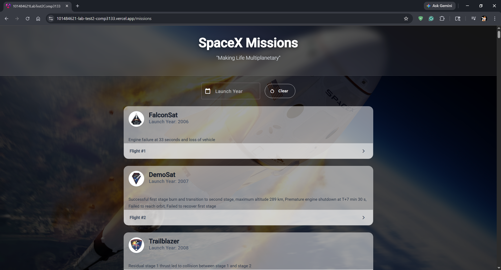
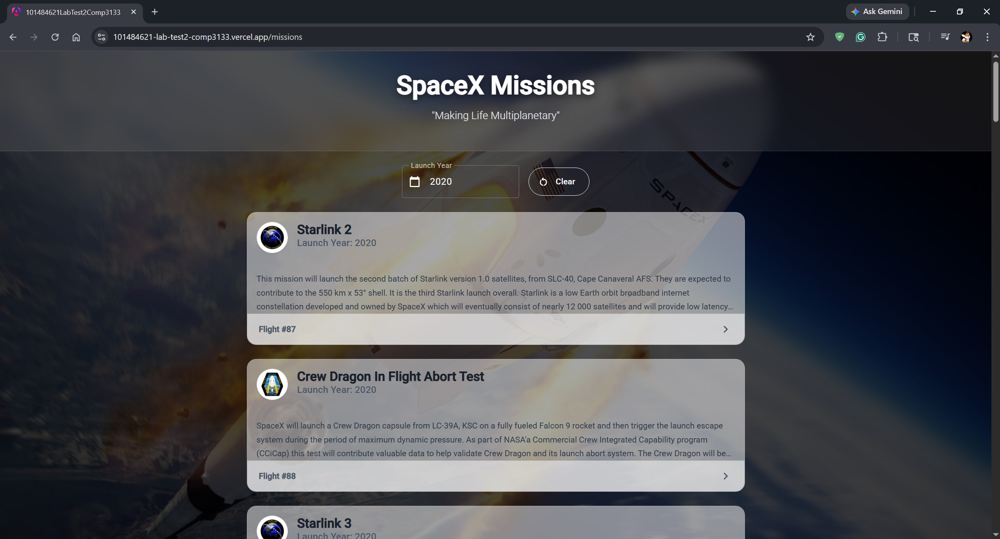
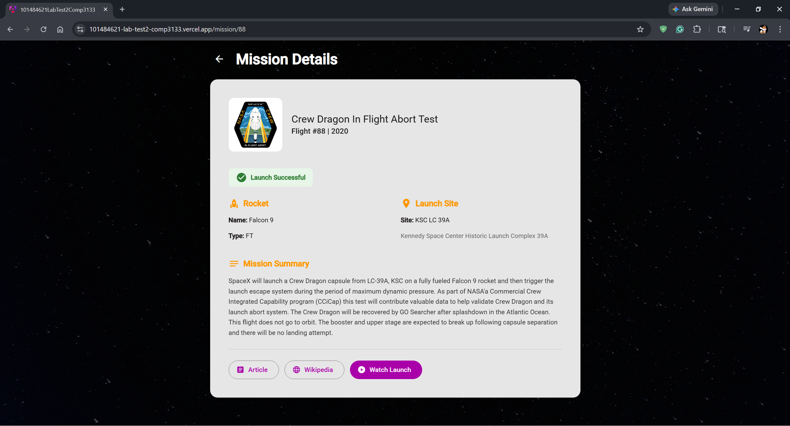

# COMP3133 - Lab Test 2 | SpaceX Mission Explorer

A SpaceX mission tracking application built with Angular 21 and Angular Material.

---

## Features Implemented

- **Mission List** — Displays all SpaceX launches fetched from the SpaceX REST API, showing the mission patch, name, launch year, and details for each mission.
- **Mission Filter** — Allows users to filter missions by launch year using the SpaceX filter endpoint.
- **Mission Details** — Clicking a mission navigates to a detailed view showing rocket info, launch details, and links to the article, Wikipedia page, and video.
- **Angular Material UI** — Cards, buttons, icons, form fields used throughout the app.
- **SpaceX REST API Integration** — Data fetched via a dedicated Angular service using `HttpClient`.
- **TypeScript Interface** — `Mission` interface defined to type all API responses.
- **Routing** — Angular Router with `/missions` and `/mission/:id` routes.

---

## Screenshots

### Mission List


Displays all SpaceX launches in Material cards with mission patch image, mission name, launch year, and details.

### Mission Filter


Users can type a launch year (e.g. `2015`) and click Filter to narrow down the list. Clicking Clear reloads all missions.

### Mission Details


Shows detailed info about a selected mission including rocket name/type, launch details, and icon links to the article, Wikipedia, and video.

---

## How to Run

**Prerequisites:** Node.js and Angular CLI installed.

```bash
# 1. Clone the repository
git clone https://github.com/YOUR_USERNAME/101484621-lab-test2-comp3133.git

# 2. Navigate into the project
cd 101484621-lab-test2-comp3133

# 3. Install dependencies
npm install

# 4. Run the development server
ng serve
```

Then open your browser and go to `http://localhost:4200`.

---

## API Reference

- All launches: `https://api.spacexdata.com/v3/launches`
- Single launch: `https://api.spacexdata.com/v3/launches/{flight_number}`
- Filter by year: `https://api.spacexdata.com/v3/launches?launch_year={year}`

---

*Developed by Jayden Lewis - 101484621*
